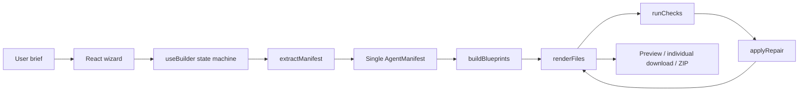

# Current Architecture

## Architectural style

The repository is a compact local-first browser application with a mostly clean four-layer split:

1. **UI** — React views and primitives.
2. **Application state** — `useBuilder` orchestrates the six-step flow.
3. **Domain core** — extraction, catalog, rendering and validation.
4. **Browser infrastructure** — ZIP, downloads and clipboard.

## Implemented user flow

1. Enter a natural-language brief.
2. Select one or more target clients.
3. Select a provider/model label.
4. Select proposed Markdown files.
5. Render files and run checks.
6. Review findings, apply limited repairs and download files/ZIP.

## Functional strengths

- Clear central manifest concept.
- Separation of domain logic from React.
- Local browser operation without an observed network call.
- Explicit uncertainty markers.
- Useful starter files: identity, cadence, tools, guardrails, domain standard, evaluation and runtime entrypoints.
- Re-render-after-repair design.
- Full ZIP preserves nested paths.

## Architectural weakness

The architecture is fundamentally **single-agent**. The word “network” refers to a set of linked files, not to an executable network of agents, task ownership, routing, handoffs, dependencies or governance.
