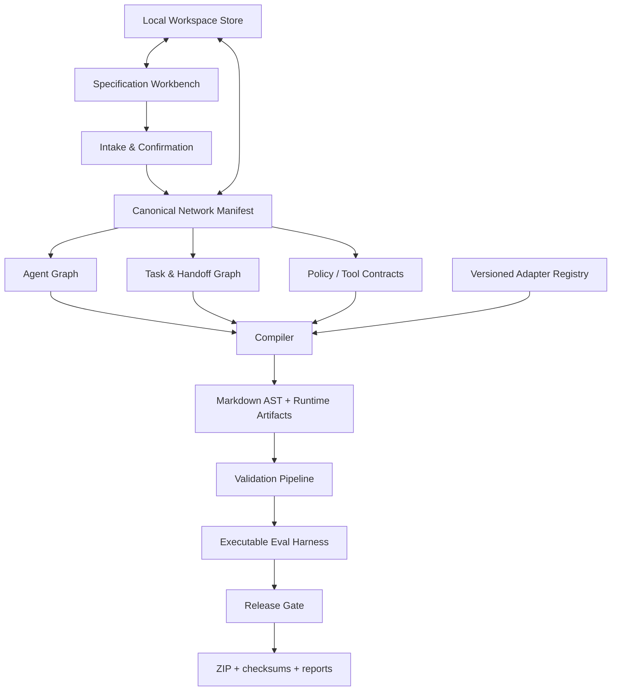

# Target Architecture — Agent Markdown Network Compiler

## Target definition

The production target is a **local-first, provider-agnostic compiler and workbench** that converts a user-approved specification into a versioned, auditable package of agent Markdown and machine-readable contracts. It must support both one agent and a network of agents.

Production-ready here means:

- the artifact is deterministic for the same canonical input and build parameters;
- every generated file validates against explicit contracts;
- runtime adapters match currently documented client behavior;
- the core flow is covered by automated tests and E2E acceptance evidence;
- unresolved blockers prevent a release artifact;
- agent behavior is not falsely guaranteed: Markdown guidance and runtime enforcement are clearly separated.

## Logical components



## Canonical domain model

### NetworkManifest

- `schema_version`
- `project_id`, `version`, `created_at`, `build_parameters`
- `goal`, `scope`, `non_goals`
- `agents[]`
- `tasks[]`
- `handoffs[]`
- `shared_policies[]`
- `tools[]`
- `runtime_targets[]`
- `evaluation_plan`
- `source_map[]`
- `truth_markers[]`

### AgentNode

- stable ID and role
- identity, purpose, authority and prohibitions
- owned tasks and accepted inputs
- required outputs and acceptance criteria
- tool permissions and approval mode
- upstream/downstream handoffs
- memory/context policy
- escalation and stop conditions

### TaskNode

- stable ID, objective, owner agent
- prerequisites and dependencies
- required inputs and produced outputs
- acceptance criteria and validation commands
- status lifecycle and retry/abort policy

### HandoffContract

- producer and consumer agent
- payload schema and maximum context
- completion evidence
- responsibility transfer and rejection reasons
- fallback and escalation path

## Compiler stages

1. Intake and scope normalization.
2. User confirmation of extracted facts and assumptions.
3. Schema validation of the canonical network manifest.
4. Dependency and cycle analysis.
5. Runtime adapter selection from a versioned registry.
6. Deterministic rendering with injected clock/build metadata.
7. Markdown AST, frontmatter, link/import, path and token-budget validation.
8. Security and prompt-injection checks.
9. Executable fixture and adapter tests.
10. Release decision: release, revise or block.
11. Package creation with checksums, source map and validation reports.

## Target output package

```text
agent-network/
├── AGENTS.md
├── CLAUDE.md
├── README_AGENT.md
├── agent-network.manifest.yaml
├── identity/
│   ├── SOUL.md
│   └── HEARTBEAT.md
├── agents/
│   └── <agent-id>/AGENT.md
├── tasks/
│   └── <task-id>.md
├── handoffs/
│   └── <handoff-id>.md
├── tools/TOOLS.md
├── policies/GUARDRAILS.md
├── workflows/WORKFLOW.md
├── evals/
│   ├── cases.yaml
│   └── expected-results.yaml
├── adapters/
│   ├── .cursor/rules/agent-network.mdc
│   ├── .github/copilot-instructions.md
│   └── .windsurf/rules/agent-network.md
├── validation/
│   ├── VALIDATION_REPORT.md
│   └── validation-report.json
└── provenance/
    ├── SOURCE_MAP.md
    ├── checksums.sha256
    └── build-info.json
```

## Non-goals for the first production candidate

- Cloud accounts and team collaboration.
- Autonomous execution of generated agents.
- Guaranteed model compliance.
- Provider billing or API proxying.

These can be added later without corrupting the compiler core.
