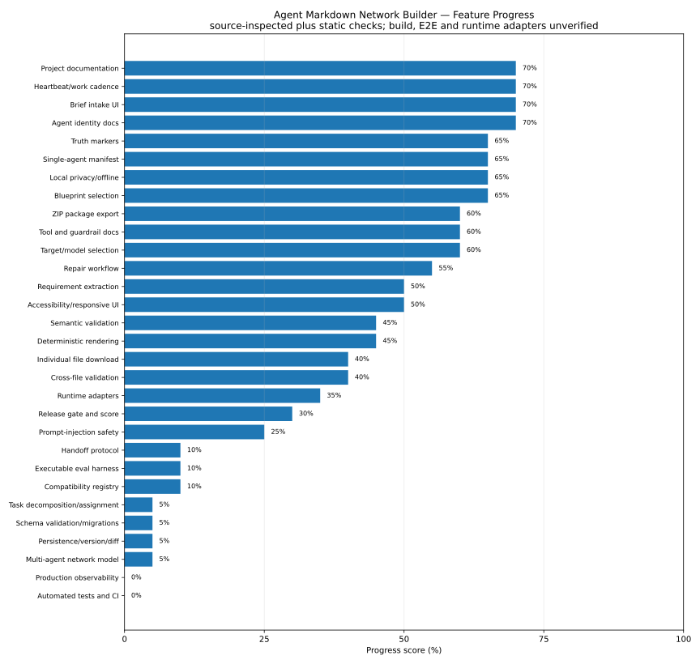

# Feature Progress

Evidence basis: source inspection plus static scans; dependency install/build/browser/E2E and runtime-client behavior remain unverified.

## Progress table

| Feature | Score | Evidence | Target state | Current state | Main gap |
|---|---:|---|---|---|---|
| Agent identity docs | 70% | source-inspected | Per-agent identity, scope, authority, constraints, and role boundaries. | SOUL.md is generated with purpose, values, capabilities, prohibitions, tone, and escalation. | Only one agent identity exists; no role inheritance or conflict resolution. |
| Brief intake UI | 70% | source-inspected | Structured intake with validated fields, assumptions, and user confirmation. | Six-step browser UI accepts a free-text brief and examples. | No structured confirmation of extracted requirements; no runtime proof. |
| Heartbeat/work cadence | 70% | source-inspected | Executable lifecycle contract with preconditions, checkpoints, completion and abort gates. | HEARTBEAT.md provides before/during/after checks and abort conditions. | Advisory Markdown only; no machine-enforced state transitions. |
| Project documentation | 70% | source-inspected | README, architecture decisions, contracts, limits, runbook, contribution and release documentation. | A focused feature-slice document explains pipeline, layers, markers, limitations, and extension points. | No root README, ADRs, deployment/runbook, or compatibility source map. |
| Blueprint selection | 65% | source-inspected | Dependency-aware package planner with required/optional modules and transparent consequences. | Blueprints are proposed, locked, selectable, and re-rendered after changes. | Dependency model is handwritten and not derived from actual Markdown AST or adapter contract. |
| Local privacy/offline | 65% | source-inspected | Local-first operation with explicit data-flow proof, CSP, no telemetry by default, and privacy tests. | No fetch, WebSocket, local storage, or backend calls were found in source; generation is browser-local. | No runtime network inspection, CSP, privacy test, or dependency supply-chain proof. |
| Single-agent manifest | 65% | source-inspected | Schema-versioned canonical manifest with stable IDs and migrations. | Typed AgentManifest is the central renderer input. | No runtime schema validation, migrations, or canonical serialization. |
| Truth markers | 65% | source-inspected | Evidence-linked markers propagated into every claim and validation result. | MISSING, ASSUMPTION, SOURCE_NEEDED, UNVERIFIED, BLOCKER are represented and rendered. | Markers are not tied to claim IDs or source evidence and do not gate release consistently. |
| Target/model selection | 60% | source-inspected | Versioned capability registry separates runtime, provider, model, and supported adapter semantics. | Hard-coded runtime/provider/model catalogs are selectable. | Catalog freshness is not verified and selection has no operational provider connection. |
| Tool and guardrail docs | 60% | source-inspected | Machine-readable tool contracts mapped to runtime permissions, hooks, and approval policies. | TOOLS.md and GUARDRAILS.md are rendered from ToolSpec and prohibitions. | Permissions are descriptive only and are not compiled into runtime enforcement configs. |
| ZIP package export | 60% | source-inspected | Tested archive export with checksums, manifest, path safety, size limits, and round-trip verification. | Dependency-free ZIP STORE writer preserves nested paths in the full archive. | No automated archive round-trip, checksum manifest, ZIP64/limit handling, or corruption test. |
| Repair workflow | 55% | source-inspected | Every finding has reversible patch, diff preview, audit trail, revalidation, and rollback. | Selected findings can mutate the manifest or add a file and trigger full re-render. | No diff preview, rollback, persisted audit trail, or comprehensive repair coverage. |
| Accessibility/responsive UI | 50% | source-inspected | WCAG-oriented keyboard, screen-reader, responsive, reduced-motion, and automated accessibility proof. | Labels, buttons, aria attributes, responsive classes, and reduced-motion timing branch are visible in source. | No browser/E2E or accessibility audit; timed progress remains misleading. |
| Requirement extraction | 50% | source-inspected | Loss-aware extraction that preserves explicit user requirements and requires confirmation for inferred fields. | Keyword and fragment rules infer domain, autonomy, stack, capabilities, and prohibitions. | User-specific inputs, outputs, success criteria, roles, and workflows are largely replaced by domain presets. |
| Deterministic rendering | 45% | source-inspected | Canonical input plus injected build metadata yields byte-for-byte reproducible core artifacts. | Pure render functions generate files from a manifest. | new Date() timestamps and ZIP timestamps make same-input outputs differ; the UI claim is too strong. |
| Semantic validation | 45% | source-inspected | Explicit rule engine plus optional model-based review, both evidence-labeled and independently testable. | Heuristic checks detect autonomy, tools, privacy, success criteria, escalation, and thin briefs. | Called semantic but implemented as deterministic regex/manifest checks; no semantic model or corpus eval. |
| Cross-file validation | 40% | source-inspected | Parse rendered Markdown, resolve actual links/imports, detect cycles, missing targets, and adapter-invalid references. | Checks compare blueprint reference arrays against selected paths. | Reference metadata diverges from rendered content, creating false negatives and false positives. |
| Individual file download | 40% | source-inspected | Download preserves required directory paths or clearly instructs placement. | Each rendered file can be downloaded separately. | saveText strips directory components, so .cursor and .github files lose their installation path. |
| Runtime adapters | 35% | source-inspected | Officially sourced, versioned adapters with fixture tests for each client and clear parity limits. | Adapters exist for Claude Code, Codex, Cursor, Copilot, Windsurf, and portable Markdown. | Windsurf path is not aligned with current documented mechanisms; Claude imports are rendered as literal backticked paths rather than @ imports; nested scopes are absent. |
| Release gate and score | 30% | source-inspected | Fail-closed release decision based on schema, tests, adapter compatibility, unresolved blockers, and eval thresholds. | A simple 100-minus-penalties score and textual blockers are shown. | UNVERIFIED runtime behavior and notes can still coexist with a 100 score and downloadable package. |
| Prompt-injection safety | 25% | source-inspected | Untrusted brief isolation, Markdown/fence escaping, instruction provenance, and policy conflict detection. | General prohibitions and uncertainty markers are generated. | User text can cross formatting/instruction boundaries; no sanitizer, AST, or injection tests. |
| Compatibility registry | 10% | source-inspected | Each adapter stores official source, verified date, supported semantics, limits, and deprecation state. | Runtime behavior and model names are hard-coded in catalog.ts. | No provenance, freshness date, compatibility test, or update workflow. |
| Executable eval harness | 10% | source-inspected | Fixtures and automated assertions for extraction, rendering, adapters, safety, and model-behavior evals. | EVALUATION.md contains manual cases with UNVERIFIED status. | No test runner, fixtures, thresholds, or result persistence. |
| Handoff protocol | 10% | source-inspected | Typed handoff contracts, context package limits, responsibility transfer, and failure escalation. | Generic escalation text exists. | No inter-agent handoff entity, routing, or contract. |
| Multi-agent network model | 5% | source-inspected | Graph of agent nodes, roles, authority, dependencies, shared policies, and routing rules. | Product name says network, but the canonical model contains one AgentManifest only. | Core target capability is absent. |
| Persistence/version/diff | 5% | source-inspected | Local projects, autosave, import, version history, manifest diff, rollback, and deterministic rebuild. | React state is session-only; exports can be downloaded. | No persistence or round-trip import. |
| Schema validation/migrations | 5% | source-inspected | JSON Schema or equivalent runtime validation, schema versioning, migrations, and invalid-input diagnostics. | TypeScript interfaces exist and documentation calls extraction schema-validated. | No schema file or runtime validation call exists. |
| Task decomposition/assignment | 5% | source-inspected | Task schema with owner agent, inputs, outputs, dependencies, acceptance criteria, and status transitions. | No task entity or assignment model exists. | Core target capability is absent. |
| Automated tests and CI | 0% | source-inspected | Unit, property, integration, archive round-trip, adapter fixtures, E2E, accessibility, and CI release gates. | No test files, test script, lint script, typecheck script, or CI configuration were found. | Entire quality automation layer is absent. |
| Production observability | 0% | source-inspected | Client error reporting with opt-in telemetry, release diagnostics, support bundle, and privacy controls. | No observability or support diagnostics exist. | Absent. |

## ASCII view

`Agent identity docs           ` ██████████████░░░░░░  70%
`Brief intake UI               ` ██████████████░░░░░░  70%
`Heartbeat/work cadence        ` ██████████████░░░░░░  70%
`Project documentation         ` ██████████████░░░░░░  70%
`Blueprint selection           ` █████████████░░░░░░░  65%
`Local privacy/offline         ` █████████████░░░░░░░  65%
`Single-agent manifest         ` █████████████░░░░░░░  65%
`Truth markers                 ` █████████████░░░░░░░  65%
`Target/model selection        ` ████████████░░░░░░░░  60%
`Tool and guardrail docs       ` ████████████░░░░░░░░  60%
`ZIP package export            ` ████████████░░░░░░░░  60%
`Repair workflow               ` ███████████░░░░░░░░░  55%
`Accessibility/responsive UI   ` ██████████░░░░░░░░░░  50%
`Requirement extraction        ` ██████████░░░░░░░░░░  50%
`Deterministic rendering       ` █████████░░░░░░░░░░░  45%
`Semantic validation           ` █████████░░░░░░░░░░░  45%
`Cross-file validation         ` ████████░░░░░░░░░░░░  40%
`Individual file download      ` ████████░░░░░░░░░░░░  40%
`Runtime adapters              ` ███████░░░░░░░░░░░░░  35%
`Release gate and score        ` ██████░░░░░░░░░░░░░░  30%
`Prompt-injection safety       ` █████░░░░░░░░░░░░░░░  25%
`Compatibility registry        ` ██░░░░░░░░░░░░░░░░░░  10%
`Executable eval harness       ` ██░░░░░░░░░░░░░░░░░░  10%
`Handoff protocol              ` ██░░░░░░░░░░░░░░░░░░  10%
`Multi-agent network model     ` █░░░░░░░░░░░░░░░░░░░   5%
`Persistence/version/diff      ` █░░░░░░░░░░░░░░░░░░░   5%
`Schema validation/migrations  ` █░░░░░░░░░░░░░░░░░░░   5%
`Task decomposition/assignment ` █░░░░░░░░░░░░░░░░░░░   5%
`Automated tests and CI        ` ░░░░░░░░░░░░░░░░░░░░   0%
`Production observability      ` ░░░░░░░░░░░░░░░░░░░░   0%
